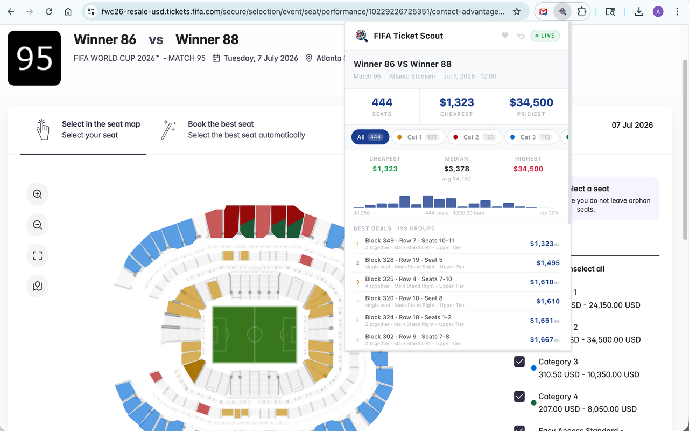
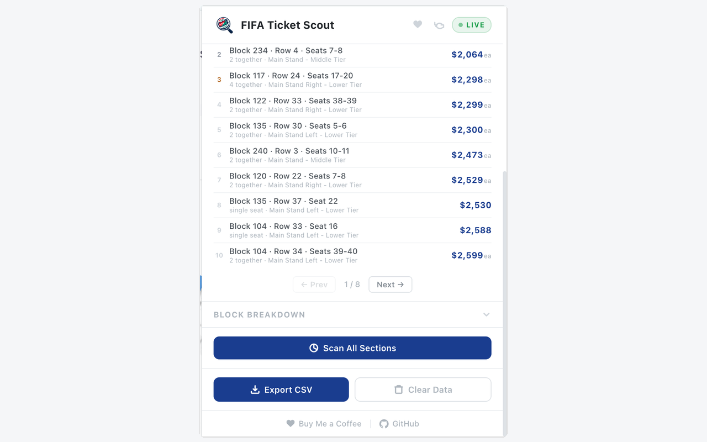

# FIFA Ticket Scout

A Chrome extension that tracks real-time seat prices for FIFA World Cup 2026 resale tickets. Browse any match on the official resale site and instantly see every available seat, price distribution, and best deals — all at a glance.


## Screenshots


*Live dashboard showing match pricing alongside the FIFA seat map*


*Best deals list, scan controls, and CSV export*

## Features

- **Live seat capture** — Automatically intercepts seat data as you browse the FIFA resale ticket site
- **Auto-scan** — Automatically scans all map sections when you open a match, so you get full coverage without lifting a finger
- **Price dashboard** — See total seats, cheapest and most expensive prices at a glance
- **Category breakdown** — Filter seats by category with price distribution histograms showing cheapest, median, average, and highest prices
- **Best deals finder** — Groups consecutive same-price seats and ranks them, with pagination
- **Block-by-block view** — Collapsible table showing seat count and min/max prices per block
- **Manual re-scan** — Trigger a full scan on demand if you want to refresh all sections
- **CSV export** — Export all seat data with match details and timestamps

## Installation

### Option 1: Chrome Web Store

Install directly from the [Chrome Web Store](#) (link coming soon).

### Option 2: Load from source

No build step required — the extension runs as-is from the repo.

1. Clone the repository:
   ```bash
   git clone https://github.com/david-dirring/fifa-ticket-scout.git
   ```
2. Open `chrome://extensions` in Chrome
3. Enable **Developer mode** (top right toggle)
4. Click **Load unpacked** and select the `extension/` folder inside the cloned repo
5. Navigate to the [FIFA World Cup 2026 Resale Tickets](https://fwc26-resale-usd.tickets.fifa.com) site and open any match seat map
6. Click the extension icon to see the dashboard

To update, just `git pull` and click the reload button on `chrome://extensions`.

> **Note:** Requires Chrome 88 or later (Manifest V3).

## How It Works

The extension uses a multi-layer architecture to capture data from the FIFA ticketing platform:

1. **`injected.js`** runs in the page's own context (MAIN world) and patches `fetch` and `XMLHttpRequest` to intercept API responses containing seat data, pricing, and match details. It also handles the full-scan feature by tiling the seat map into a 5x5 grid and requesting each section.

2. **`content.js`** bridges the page context and the extension by relaying messages between `injected.js` and the background service worker.

3. **`background.js`** processes incoming API data, deduplicates seats by ID, and stores everything in `chrome.storage.local`. It also auto-triggers a full scan when a new match is detected.

4. **`popup.js` + `popup.html`** read from storage and render the dashboard UI — stats, histograms, best-deal clusters, and block breakdown.

Displayed prices include the platform's 15% service fee.

## Project Structure

```
extension/
  manifest.json    Chrome extension manifest (V3)
  background.js    Service worker — data processing and storage
  injected.js      Runs in page context — intercepts API calls, runs scans
  content.js       Bridges page context and extension messaging
  popup.html       Extension popup markup
  popup.js         Dashboard rendering and interaction logic
  popup.css        All popup styles
  icons/           Extension icons (16, 48, 128px)
```

## Tech Stack

- **Vanilla JavaScript** — no frameworks, no build step, no dependencies
- **Chrome Manifest V3** APIs — `chrome.storage.local`, `chrome.runtime`, `chrome.tabs`
- **HTML/CSS** — hand-written popup UI

## Privacy

- All data is stored locally in Chrome's extension storage
- No external servers or analytics
- No data collection whatsoever
- The extension only activates on `fwc26-resale-usd.tickets.fifa.com`

## Publishing to Chrome Web Store

See [`STORE_LISTING.md`](STORE_LISTING.md) for the full store listing copy, required assets checklist, and submission steps.

## Disclaimer

This project is for **personal and educational use only**. It is not affiliated with, endorsed by, or connected to FIFA, Secutix, or any official ticketing partner. Use of this extension is at your own risk. The author is not responsible for any consequences resulting from its use, including but not limited to account restrictions on the ticketing platform. Please review and comply with the terms of service of any site you use this extension on.

## Support

If you find this useful, consider buying me a coffee!

[](https://buymeacoffee.com/davidrd)

## License

[ISC](LICENSE)
